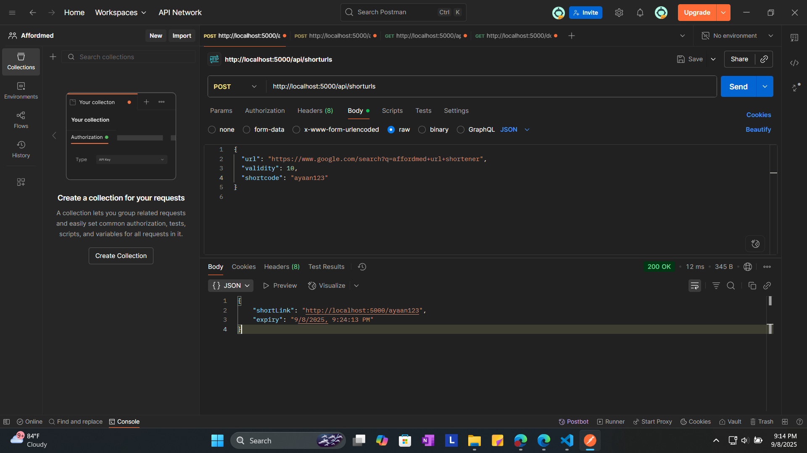

# Affordmed URL Shortener — Roll No: 2201641530103

## Shorten URLs Interface
Users can shorten up to 5 URLs with custom shortcodes and expiry settings.


## Statistics Dashboard
Track click counts, timestamps, and sources for each shortcode.


## Project Overview
This is a full-stack URL Shortener built for the Affordmed campus hiring evaluation. It allows users to:
- Create short URLs with custom shortcodes and expiry
- Track click statistics and sources
- Clear stats and copy links via frontend controls
- View and manage all created links in a dashboard

##  Tech Stack
- **Frontend**: React, Material UI
- **Backend**: Node.js, Express
- **Logging**: Custom middleware (frontend + backend)
- **Storage**: In-memory (for simplicity and speed)

## 🚀 Features
- RESTful API for URL creation, redirection, and stats
- Expiry logic and shortcode conflict detection
- Click tracking with timestamp and source
- Logging middleware for observability
- Frontend stats dashboard with copy + clear actions

## 📂 Folder Structure
```
affordmed-url-shortener/
├── backend/
│   ├── server.js
│   └── package.json
├── frontend/
│   ├── src/
│   │   ├── pages/
│   │   │   └── stats.jsx
│   │   └── App.jsx
│   ├── public/
│   └── package.json
├── logging-middleware-backend/
│   ├── index.js
│   └── package.json
├── logging-middleware-frontend/
│   ├── index.js
│   └── package.json
├── README.md
└── .gitignore
```

## 🧪 How to Run Locally

### Backend
```bash
cd backend
npm install
node server.js
```

### Frontend
```bash
cd frontend
npm install
npm start
```
### Access the App
Frontend: `http://localhost:3000`

Backend API: `http://localhost:5000`

### Screenshots

## POST Request via Postman
Testing the URL shortening API with custom shortcode and webhook integration.



## Attendance API Response
Example of a successful GET request returning structured attendance data.


## Index Not Found Error
Handling a 404 error when querying a non-existent index.


## Expired Link Response
Example of a 401 Unauthorized response due to link expiry.

